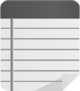

## 更新情報
2025/1/8 Chrome Web Store にリリースしました！　以下のリンクからダウンロードできます。
https://chromewebstore.google.com/detail/the-memo/lhkkklfkaoifbinakklcgdpnhgombgdk

## 概要

シンプルなメモ拡張機能です。
- ポップアップメニューにメモを残すことができます。
- 書いたメモはURLに紐づいて保存され、同じURLのページを開いた際に表示できます。

可能な限りシンプルに実装していますが、拡張機能である性質上、完全な動作は保証できません。データベースとしての利用は推奨しません。重要な情報は保存しないでください。

この拡張機能を使用することにより生じた損害について、作者は一切の責任を負いません。

## おすすめの設定

- ツールバーにピン止めしておくと、そのページにメモが存在するかどうかをアイコンでチェックできます。

| メモがあるときのアイコン | メモがない時のアイコン |
|:------------------------:|:----------------------:|
|  |  |

- 拡張機能にショートカットを割り当てると素早くメモを残すことができます。ctrl+mあたりがおすすめ(chrome://extensions/shortcuts)
