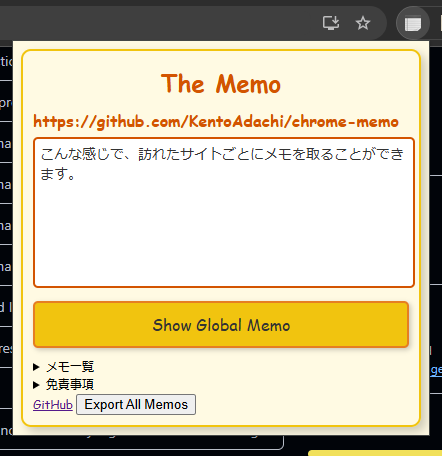

## 概要

シンプルなメモ拡張機能です。
- ポップアップメニューにメモを残すことができます。
- 書いたメモはURLに紐づいて保存され、同じURLのページを開いた際に表示できます。

Webサイトで勉強する際に、進捗や動画の再生位置をメモしておくために開発しました。
シンプルであることを重視しているため、メモの一覧表示や検索機能はありません。
データベースとしての利用は推奨しません。重要な情報は保存しないでください。

この拡張機能を使用することにより生じた損害について、作者は一切の責任を負いません。

## おすすめの設定

- タスクバーにピン止めしておくと、そのページにメモが存在するかどうかをアイコンでチェックできます。
- 拡張機能にショートカットを割り当てると素早くメモを残すことができます。